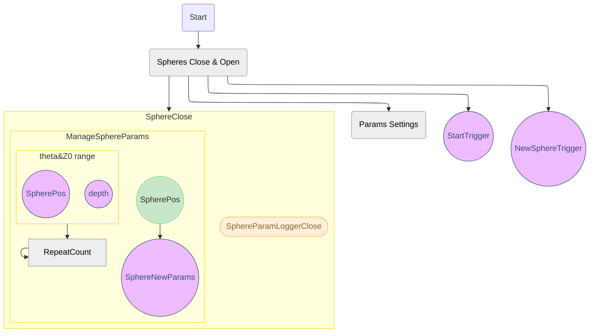

# Workflow Logic

At the core of the workflow, we create a set of N observables in `CreateSpheres`. They all have a `SphereIndex` 

## Create Spheres

## Global workflow

```mermaid
---
config:
  layout: elk
---
flowchart TD
 subgraph rd["theta&Z0 range"]
        sphere_pose(("SpherePos"))
        depth(("depth"))
  end
 subgraph MSP["ManageSphereParams"]
        rd
        repeat["RepeatCount"]
        snp(("SphereNewParams"))
        spr(("SpherePos"))
  end
 subgraph SC["SphereClose"]
        MSP
        SphereParamLoggerClose(["SphereParamLoggerClose"])
  end
    spr --> snp
    rd --> repeat
    repeat --> repeat
    S("Start") --> M("Spheres Close & Open")
    M --> P("Params Settings") & st(("StartTrigger")) & nsw(("NewSphereTrigger")) & SC
     sphere_pose:::emit
     depth:::emit
     repeat:::emit
     repeat:::Ash
     snp:::emit
     spr:::listen
     SphereParamLoggerClose:::Peach
     M:::emit
     M:::Ash
     P:::Ash
     st:::emit
     nsw:::emit
    classDef Ash stroke-width:1px, stroke-dasharray:none, stroke:#999999, fill:#EEEEEE, color:#000000
    classDef listen stroke:#00C853, fill:#C8E6C9, stroke-width:1px, stroke-dasharray: 1
    classDef emit stroke-width:1px, stroke-dasharray:none, stroke:#374D7C, fill:#EEBBFF, color:#374D7C
    classDef Peach stroke-width:1px, stroke-dasharray:none, stroke:#FBB35A, fill:#FFEFDB, color:#8F632D
    style rd stroke:#FFD600
    style MSP stroke:#FFD600   
    style SC stroke:#FFD600
```
